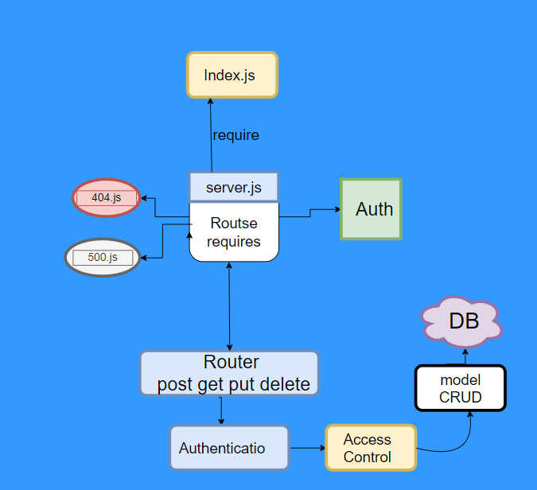

# auth-api
## Author: Abdalrhman Albdahat
## lab8

### Important links
- [GitHup repo](https://github.com/boodah96/auth-api)
- [GitHup Actions](https://github.com/boodah96/auth-api/actions)
- [Heroku](https://auth-api-boodah96.herokuapp.com/)

#### Start work on this app with these commands:

- clone this repo

- `npm init -y`

- `npm i express dotenv jsonwebtoken morgan base-64 bcrypt cors mongoose`

- to **test** follow these command:

`npm i jest supertest @code-fellows/supergoose`
`npm test `

## UML diagram:
